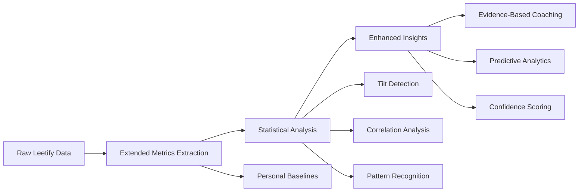

# Architecture & Data Flow

## System Overview

The CS2 Coach MCP server is a modular, TypeScript-first system for local AI-powered Counter-Strike 2 coaching. It is organized for testability, scalability, and maintainability, with strict separation of concerns and clear data flow.

---

## Data Flow Pipeline

---

## Component Structure (with Code Links)

### Handlers (MCP Tool Orchestration)
- [`src/handlers/`](../src/handlers/)
     - [`coachingHandler.ts`](../src/handlers/coachingHandler.ts): General coaching advice
     - [`areaAnalysisHandler.ts`](../src/handlers/areaAnalysisHandler.ts): Area-specific analysis
     - [`improvementHandler.ts`](../src/handlers/improvementHandler.ts): Improvement tracking
     - [`rankComparisonHandler.ts`](../src/handlers/rankComparisonHandler.ts): Rank benchmarking
     - [`enhancedAnalysisHandler.ts`](../src/handlers/enhancedAnalysisHandler.ts): Enhanced statistical analysis

### Services (Business Logic)
- [`src/services/`](../src/services/)
     - [`analysis/`](../src/services/analysis/): Statistical and data transformation logic
          - [`leetify-data-transformer.ts`](../src/services/analysis/leetify-data-transformer.ts): Main transformer, implements `generateEnhancedAnalysis()` and all core analysis methods
          - [`metrics.ts`](../src/services/analysis/metrics.ts): Extended Leetify field extraction
          - [`area.ts`](../src/services/analysis/area.ts): Area-specific analysis helpers
          - [`baseline.ts`](../src/services/analysis/baseline.ts): Personal baseline calculation
          - [`baseline-storage.ts`](../src/services/analysis/baseline-storage.ts): Baseline caching and persistence
          - [`tilt-detector.ts`](../src/services/analysis/tilt-detector.ts): Multi-factor tilt detection
          - [`state-classifier.ts`](../src/services/analysis/state-classifier.ts): Performance state classification
          - [`correlation-analyzer.ts`](../src/services/analysis/correlation-analyzer.ts): Correlation and significance testing
          - [`pattern-detector.ts`](../src/services/analysis/pattern-detector.ts): Momentum and cascade detection
     - [`leetify/`](../src/services/leetify/): Leetify API client ([`index.ts`](../src/services/leetify/index.ts))
     - [`ollama/`](../src/services/ollama/): AI integration ([`index.ts`](../src/services/ollama/index.ts), [`prompts.ts`](../src/services/ollama/prompts.ts))
     - [`utils.ts`](../src/services/utils.ts): Shared helpers

### Utilities
- [`src/utils/helpers.ts`](../src/utils/helpers.ts): Caching, math, and general helpers

### Types & Schemas
- [`src/types/`](../src/types/):
     - [`index.ts`](../src/types/index.ts): Central zod schemas and type exports
     - [`analysis.ts`](../src/types/analysis.ts), [`coaching.ts`](../src/types/coaching.ts), etc.: Domain-specific types

### MCP Server Entrypoint
- [`src/server.ts`](../src/server.ts): Wires up handlers, configures MCP protocol, no business logic

---

## Data Flow (Step-by-Step)

1. **Input Validation**: All tool inputs are validated using zod schemas in [`src/types/`](../src/types/).
2. **Request Handling**: Handlers in [`src/handlers/`](../src/handlers/) orchestrate each MCP tool, validate input, and delegate to services.
3. **Data Fetching**: The Leetify API client ([`src/services/leetify/index.ts`](../src/services/leetify/index.ts)) fetches player statistics.
4. **Data Processing**: The data transformer ([`src/services/analysis/leetify-data-transformer.ts`](../src/services/analysis/leetify-data-transformer.ts)) processes raw stats into structured insights.
5. **AI Analysis**: The Ollama service ([`src/services/ollama/index.ts`](../src/services/ollama/index.ts)) generates personalized coaching advice (optional, can be skipped for fast analysis).
6. **Response Formatting**: Handlers return structured, actionable coaching recommendations.

---

## Modularity & Rationale

- **Separation of Concerns**: Handlers orchestrate, services implement business logic, utils are shared helpers.
- **Testability**: Each layer is independently testable (see [`tests/`](../tests/)).
- **Scalability**: New tools/features can be added with minimal impact on existing code.
- **Maintainability**: Clear boundaries and file size limits (<500 lines) make the codebase easy to navigate and refactor.

---

## Example: Enhanced Analysis Pipeline

1. **Raw Data**: Fetched from Leetify API ([`src/services/leetify/index.ts`](../src/services/leetify/index.ts))
2. **Transformation**: Processed by [`leetify-data-transformer.ts`](../src/services/analysis/leetify-data-transformer.ts)
3. **Statistical Modules**: Baseline, tilt, state, correlation, and pattern modules ([`src/services/analysis/`](../src/services/analysis/))
4. **AI Commentary**: (Optional) via [`src/services/ollama/`](../src/services/ollama/)
5. **Handler Orchestration**: Response assembled and returned by handler ([`src/handlers/enhancedAnalysisHandler.ts`](../src/handlers/enhancedAnalysisHandler.ts))

---

## See Also
- [README.md](../README.md) — Project overview, setup, and usage
- [PLANNING.md](../PLANNING.md) — Roadmap and design notes
- [TASK.md](../TASK.md) — Task tracking and todos
